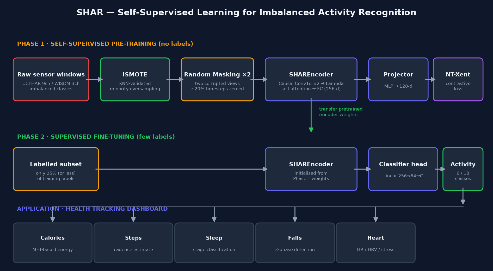
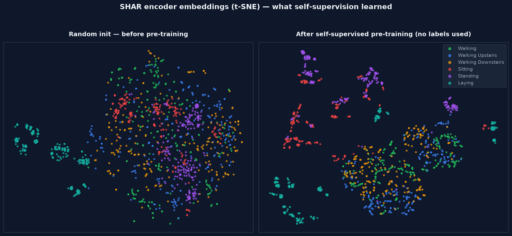

# SHAR — Self-Supervised HAR + Health Tracking Dashboard

[](https://github.com/Nandukumar-koribilli/imbalanced_datasets/actions/workflows/ci.yml)

PyTorch implementation of **Self-Supervised Learning for Activity Recognition Based on Datasets With Imbalanced Classes** (SHAR), plus a **Health Tracking Dashboard** that turns the activity-recognition engine into practical health insights: calories, steps, sleep staging, fall detection, and heart-rate/stress monitoring.



---

## 🚀 Easy Install (3 steps)

```powershell
# 1. Install dependencies
python -m pip install -r requirements.txt
python -m pip install "streamlit==1.38.0" "pyarrow==25.0.0" # Critical for Windows stability!

# 2. Train the models (Contrastive + Masked Autoencoder)
python main.py --pretrain_epochs 50 --finetune_epochs 50 --label_ratio 0.25
python main_mae.py --pretrain_epochs 80 --finetune_epochs 60 --label_ratio 0.25

# 3. Launch the Health Tracking Dashboard
python -m streamlit run health_tracking/app.py --server.fileWatcherType none
```

**The datasets are already in place** — `UCI HAR Dataset/` and `wisdm-dataset/` sit at the project root, right where the code expects them.

> **Windows tip:** if `streamlit` isn't recognized, use `python -m streamlit run ...` (always works),
> or open a **new** terminal.

---

## Requirements

* **Python 3.10 or newer** (tested on 3.11 and 3.14)
* `torch`, `torchvision`, `numpy`, `scipy`, `pandas`, `scikit-learn`, `matplotlib`, `seaborn`, `streamlit`
* **Windows only:** the Microsoft Visual C++ 2015–2022 Redistributable (x64).
  If `import torch` fails with `OSError: [WinError 1114] ... c10.dll`, install it from
  <https://aka.ms/vs/17/release/vc_redist.x64.exe>. Reinstalling torch will NOT fix it.

Virtual environment (optional but recommended):

```powershell
python -m venv .venv
.venv\Scripts\activate          # Windows
# source .venv/bin/activate     # Linux / macOS
python -m pip install torch torchvision numpy scipy pandas scikit-learn matplotlib seaborn streamlit
```

---

## What's in the Box

```
imbalanced_datasets/
├── main.py                    # UCI HAR pipeline (pretrain → finetune → evaluate)
├── main_wisdm.py              # WISDM pipeline (same, 18 classes)
├── main_mae.py                # UCI HAR MAE pipeline (masked autoencoder)
├── main_mae_wisdm.py          # WISDM MAE pipeline
├── app.py                     # Research dashboard (Streamlit)
├── README.md                  # you are here
│
├── UCI HAR Dataset/           # ← dataset #1 (already extracted)
│   ├── train/  test/          # inertial signals + labels
│   ├── activity_labels.txt    # class names
│   └── README.txt, features.txt, features_info.txt
│
├── wisdm-dataset/             # ← dataset #2 (already extracted, cleaned)
│   ├── raw/phone/accel/       # 51 subject files (data_*_accel_phone.txt)
│   ├── activity_key.txt       # A..S → human-readable activities
│   ├── README.txt
│   └── WISDM-dataset-description.pdf
│
├── src/
│   ├── dataset_utils.py       # UCI HAR loading + DataLoaders
│   ├── dataset_utils_wisdm.py # WISDM loading + windowing
│   ├── ismote.py              # iSMOTE class-balancing algorithm
│   ├── random_masking.py      # Random Masking augmentation
│   ├── lambda_layer.py        # Lambda self-attention (einsum)
│   ├── shar_model.py          # SHAREncoder / SHAR_Pretrain / SHAR_Classifier
│   ├── mae_model.py           # MAE1D / MAEEncoder (masked autoencoder)
│   ├── train_pretrain.py      # Contrastive self-supervised pre-training
│   ├── train_finetune.py      # Contrastive fine-tuning + evaluation
│   ├── train_pretrain_mae.py      # MAE self-supervised pre-training (UCI HAR)
│   ├── train_pretrain_mae_wisdm.py # MAE pre-training (WISDM)
│   ├── train_finetune_mae.py      # MAE fine-tuning + evaluation (UCI HAR)
│   └── train_finetune_mae_wisdm.py # MAE fine-tuning (WISDM)
│
├── health_tracking/
│   ├── app.py                 # Health Tracking Dashboard (Streamlit)
│   ├── health_metrics.py      # Pure-logic health metrics engine
│   ├── config.py              # MET values, HR zones, thresholds, label maps
│   └── README.md              # metrics formulas + how each page works
│
├── models/                    # trained checkpoints land here (.pth)
├── results/                   # generated figures (iSMOTE dist, confusion matrix)
├── scripts/                   # paper-table generation utilities
└── docs/                      # the SHAR paper (PDF)
```

Both datasets have been flattened and cleaned — no more triple-nested `wisdm-dataset/wisdm-dataset/wisdm-dataset/` folders, no `__pycache__`, no `.DS_Store`, no unused arff files, no editor swap files.

---

## How to Run

### 1. Health Tracking Dashboard (no training required)

```powershell
python -m streamlit run health_tracking/app.py
```

Open <http://localhost:8501>. The dashboard is a **two-step workflow**:

**🗂️ Step 1 — Dataset & Balancing** (the landing page, always visible)
1. Pick a dataset — **UCI HAR** (6 activities · 9 channels) or **WISDM** (18 activities · 3 channels). Each card shows what the dataset contains and whether it's found on disk.
2. The original class distribution loads and is charted — you see the raw imbalance ratio, total windows, class count, and sensor channels.
3. Click **🚀 Run iSMOTE**. A spinner runs while iSMOTE synthesises minority-class samples and rejects overlapping candidates (30–60 s on the demo subsample).
4. When it finishes you get: a green "Balancing finished for the *{dataset}* dataset" banner, side-by-side **before / after** distribution charts, per-class breakdown table, and a peek at a raw signal window from the selected dataset.

**📊 Step 2 — Dashboard** (unlocked after balancing)
The health pages (Dashboard, Calories & Steps, Sleep Analysis, Fall Detection, Heart & Stress) plus the Live Activity Classifier become available in the sidebar. **All of them are scoped to the dataset you selected in Step 1** — activity dropdowns list only that dataset's activities, the timeline substitutes any missing labels, and the classifier loads that dataset's test split and checkpoint. Every dashboard page shows a "📦 Working on dataset: *X*" banner so you always know which dataset the numbers refer to.

Highlights once a model is trained:
* **📊 Activity Classifier** — shows the trained model's real test accuracy / macro-F1 / per-class F1 (from `results/metrics.json`), the t-SNE "what self-supervision learned" figure, and per-sample live inference with confidence bars.
* **📄 Export Report** — Step 1 offers a downloadable PDF (balancing summary + charts + test metrics) to hand to reviewers.

You can go back to Step 1 at any time to switch datasets — the balancing state resets and the dashboard re-locks until you rebalance.

### 2. Train the SHAR model (Contrastive)

```powershell
# UCI HAR — full run
python main.py --pretrain_epochs 50 --finetune_epochs 50 --label_ratio 0.25

# UCI HAR — quick smoke test (minutes on CPU)
python main.py --pretrain_epochs 1 --finetune_epochs 1 --label_ratio 0.10

# WISDM (18 classes)
python main_wisdm.py --pretrain_epochs 50 --finetune_epochs 50 --label_ratio 0.25
```

### 3. 🎭 Train with Masked Autoencoder (MAE) — for higher accuracy

The MAE pipeline uses **reconstruction-based** self-supervised learning instead of contrastive learning. The encoder must reconstruct 75% of randomly masked patches, forcing it to learn deeper temporal structure from the sensor data. 

**Run these commands to train the MAE models and enable the "Masked Autoencoder (MAE)" option in the Dashboard:**

```powershell
# 🏆 UCI HAR — MAE full run (Best Accuracy)
python main_mae.py --pretrain_epochs 80 --finetune_epochs 60 --label_ratio 0.25

# ⚡ UCI HAR — MAE quick smoke test
python main_mae.py --pretrain_epochs 2 --finetune_epochs 2 --max_pretrain_samples 500

# 🏆 WISDM — MAE full run (18 classes)
python main_mae_wisdm.py --pretrain_epochs 80 --finetune_epochs 60 --label_ratio 0.25

# ⚡ WISDM — MAE quick smoke test
python main_mae_wisdm.py --pretrain_epochs 2 --finetune_epochs 2 --max_pretrain_samples 500
```

> **MAE-specific arguments**: `--mask_ratio` (0.75 = mask 75% of patches).
> **GPU auto-detection:** All pipelines automatically use a CUDA GPU if available; otherwise, they seamlessly fall back to CPU.

### Training Outputs

Both pipelines produce outputs in `models/` and `results/`:

| Output | Pipeline | Purpose |
|---|---|---|
| `models/shar_encoder_pretrained.pth` | Contrastive | Self-supervised encoder weights |
| `models/shar_classifier_finetuned.pth` | Contrastive | **Full fine-tuned classifier** — used by dashboards |
| `models/mae_encoder_pretrained.pth` | MAE | MAE self-supervised encoder weights |
| `models/mae_classifier_finetuned.pth` | MAE | MAE fine-tuned classifier |
| `results/ismote_distribution.png` | Both | Class balance before/after iSMOTE |
| `results/confusion_matrix.png` | Contrastive | Test-set confusion matrix |
| `results/confusion_matrix_mae.png` | MAE | Test-set confusion matrix (MAE) |
| `results/metrics.json` | Contrastive | Accuracy, F1, per-class report |
| `results/metrics_mae.json` | MAE | Accuracy, F1, per-class report (MAE) |

WISDM outputs get a `_wisdm` suffix on all filenames.

**Common arguments** (all pipelines): `--data_dir`, `--batch_size` (128), `--lr`, `--pretrain_epochs`, `--finetune_epochs`, `--label_ratio` (0.25 = use 25 % of labels), `--max_pretrain_samples`.

### 4. Research Dashboard

```powershell
python -m streamlit run app.py
```

Explore raw sensor signals, visualize the iSMOTE balancing, compare Contrastive vs MAE results side-by-side, and run live classification with the trained encoder.

---

## Key Contributions Implemented

1. **iSMOTE** — Improved SMOTE for imbalanced sensor datasets: generates a synthetic minority sample, then uses a K-nearest-neighbours check on the *entire dataset* to reject samples whose neighbours don't match the minority class. Prevents class overlap.
2. **Random Masking (RM)** — batch-level pretext-task augmentation that zeroes ~20 % of timesteps to break identity mappings during self-supervised training.
3. **Lambda Layer + 1D Causal CNN (SHAREncoder)** — an efficient self-attention alternative implemented from scratch with `einsum`, computing the Content Lambda ($L_c = K^T V$) and applying it to the Queries — much cheaper than standard attention for long temporal sequences.
4. **Contrastive Pre-training** — NT-Xent loss on two randomly-masked views of each sample builds representations that transfer with very little labelled data.
5. **Masked Autoencoder (MAE) Pre-training** — Reconstruction-based self-supervised learning that masks 75% of input patches and forces the Transformer encoder to reconstruct them. Learns richer temporal representations than contrastive learning, especially beneficial for imbalanced datasets where within-class temporal patterns matter.
6. **Health Tracking Application** — MET-based calorie estimation, cadence-based step counting, threshold-based Deep/Light/REM sleep staging, three-phase fall detection (free-fall → impact → immobility), and simulated HR/HRV stress analysis, all driven by the recognized activity.

## Reproducing the Research Results

```powershell
# End-to-end Contrastive training
python main.py --pretrain_epochs 50 --finetune_epochs 50 --label_ratio 0.25

# End-to-end MAE training (for higher accuracy)
python main_mae.py --pretrain_epochs 80 --finetune_epochs 60 --label_ratio 0.25

# Ablation study: supervised-from-scratch vs SSL vs SSL+iSMOTE,
# across label ratios (1/5/10/25 %) with 3 seeds and error bars
python scripts/run_ablations.py                # full study (hours on CPU)
python scripts/run_ablations.py --quick        # smoke test in minutes

# "What did self-supervision learn" figure — t-SNE of encoder embeddings
# before vs after label-free pre-training
python scripts/plot_embeddings.py

# Architecture diagram (docs/architecture.png)
python scripts/make_architecture_diagram.py
```

Outputs land in `results/`: `metrics.json` / `metrics_mae.json` (test accuracy, macro F1, per-class report), `ablations.json` / `ablations.png` / `ablations.md`, `embedding_tsne.png`, `ismote_distribution.png`, `confusion_matrix.png` / `confusion_matrix_mae.png`.

## Results on UCI HAR

Running the complete pipeline (`--pretrain_epochs 50 --finetune_epochs 50 --label_ratio 0.25`) achieves **87.3 % test accuracy** and **0.873 macro F1** using only a quarter of the training labels:

| Class | Precision | Recall | F1 |
|---|---|---|---|
| Walking | 0.943 | 0.871 | 0.906 |
| Walking Upstairs | 0.887 | 0.866 | 0.877 |
| Walking Downstairs | 0.858 | 0.962 | **0.907** |
| Sitting | 0.741 | 0.811 | 0.774 |
| Standing | 0.860 | 0.788 | 0.822 |
| Laying | 0.957 | 0.952 | 0.954 |

Note the minority classes (Walking Upstairs / Downstairs — the smallest classes in the training set) reach F1 ≥ 0.88, on par with the majority classes: this is the iSMOTE balancing doing its job. Per-run numbers are saved to `results/metrics.json` and shown inside the dashboard's Activity Classifier page.




## Testing

```powershell
python -m pip install pytest
python -m pytest tests/ -v
```

25+ unit tests cover the health-metrics engine (calorie math, step detection, sleep staging, three-phase fall detection), the iSMOTE algorithm (balancing, original preservation, cluster containment of synthetics), and the model architecture (output shapes for both datasets, checkpoint loading, random-masking behaviour). The same suite runs in GitHub Actions on every push — torch-dependent tests skip automatically where torch is unavailable.

---

## Troubleshooting

| Problem | Fix |
|---|---|
| `streamlit` is not recognized | Use `python -m streamlit run ...`, or open a new terminal (PATH changes don't apply to already-open shells). |
| `OSError: [WinError 1114] ... c10.dll` on `import torch` | Install <https://aka.ms/vs/17/release/vc_redist.x64.exe>. Reinstalling torch does not help. |
| **Silent crashes on Windows** (e.g. `ntdll.dll` / `arrow.dll` / Dashboard instantly exiting) | This is a known threading conflict in Python 3.13 on Windows. Fix by downgrading Streamlit: `python -m pip install "streamlit==1.38.0" "pyarrow==25.0.0"`. Also, start the dashboard with the `--server.fileWatcherType none` flag. |
| "Model or dataset not available" on the Live Activity Classifier page | Run `python main.py` and `python main_mae.py` once — they save the `.pth` files which the dashboard loads. |
| Classifier page warns "only the pretrained encoder was found" | Predictions unreliable until you finish fine-tuning (`main.py` / `main_mae.py` handles both phases). |
| iSMOTE is taking too long | The dashboard subsamples to 1,500 windows for a responsive demo. For the full-dataset run, use `python main.py`. |
| Port 8501 already in use | `python -m streamlit run health_tracking/app.py --server.port 8502` |
| Want to relocate a dataset | Pass `--data_dir "path\to\your\folder"` to the training scripts. |
